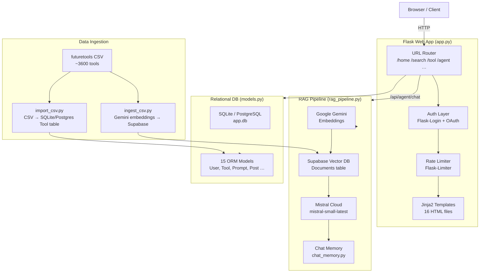
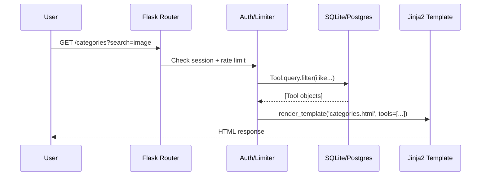
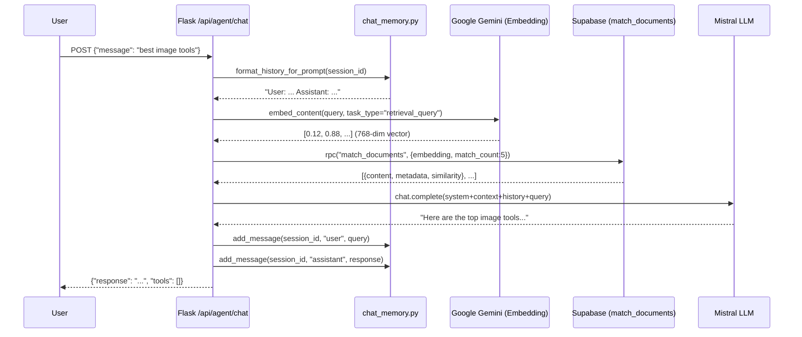
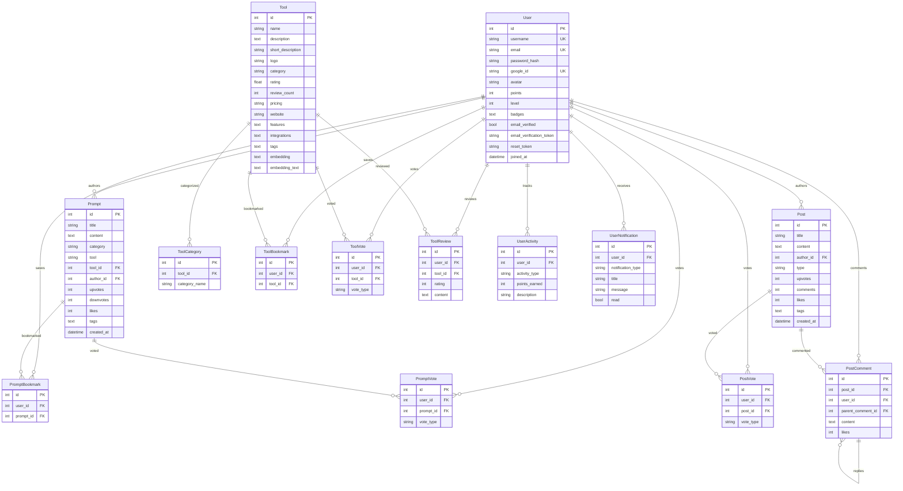

# RAG-SEARCH (ANY SITE HUB) — Complete Project Documentation

> **Project name across the codebase:** ANY SITE HUB (also referred to as AI TOOLS HUB / STERO SONIC LABS)  
> **Primary file:** [app.py](file:///c:/Users/sharm/OneDrive/%E3%83%89%E3%82%AD%E3%83%A5%E3%83%A1%E3%83%B3%E3%83%88/VSCODE/RAG-SEARCH/app.py) · **Database:** [app.db](file:///c:/Users/sharm/OneDrive/%E3%83%89%E3%82%AD%E3%83%A5%E3%83%A1%E3%83%B3%E3%83%88/VSCODE/RAG-SEARCH/app.db) (SQLite dev) / PostgreSQL (production)  
> **Last analysed:** March 2026

---

## Table of Contents
1. [Introduction](#1-introduction)
2. [System Architecture](#2-system-architecture)
   - [Component Overview](#21-component-overview)
   - [Directory Structure](#22-directory-structure)
   - [Data Flow Diagram](#23-data-flow-diagram)
   - [Database Schema](#24-database-schema)
3. [Methodology](#3-methodology)
   - [RAG Pipeline (AI Agent)](#31-rag-pipeline-ai-agent)
   - [Search System](#32-search-system)
   - [User Authentication & Security](#33-user-authentication--security)
   - [Gamification Engine](#34-gamification-engine)
   - [Data Ingestion Pipeline](#35-data-ingestion-pipeline)
   - [Memory Management & Performance](#36-memory-management--performance)
4. [API Reference](#4-api-reference)
5. [Templates (Frontend)](#5-templates-frontend)
6. [Configuration & Environment Variables](#6-configuration--environment-variables)
7. [Deployment](#7-deployment)

---

## 1. Introduction

RAG-SEARCH (ANY SITE HUB) is a **full-stack AI tools discovery & community platform** built with Python/Flask. It aggregates thousands of AI tools scraped from FutureTools.io, lets users browse, review, bookmark, and discuss them — and provides an intelligent **Retrieval-Augmented Generation (RAG) AI Agent** that answers natural-language queries about tools from a Supabase vector database.

### Key Capabilities

| Capability | Description |
|---|---|
| **AI Tool Directory** | Browse, search, filter, and review thousands of AI tools |
| **RAG AI Agent** | Natural-language Q&A powered by Gemini embeddings + Supabase VectorDB + Mistral LLM |
| **Semantic Search** | Hybrid keyword + vector similarity search via `sentence-transformers` |
| **Prompt Library** | Community-contributed prompts for various AI tools |
| **Community Forum** | Posts, discussions, and Q&A with voting and comments |
| **Gamification** | Points, levels, badges, and streaks for user engagement |
| **Authentication** | Email/password + Google OAuth 2.0 + email verification |
| **SEO** | Dynamic `sitemap.xml`, `robots.txt`, and meta injection |
| **PWA Ready** | Web manifest and all required icon sizes |

### Technology Stack

| Layer | Technology |
|---|---|
| **Backend Framework** | Flask 2.3.3 |
| **ORM** | Flask-SQLAlchemy 3.1.1 / SQLAlchemy 2.0 |
| **Auth** | Flask-Login 0.6.3 + Authlib 1.2.1 (Google OAuth) |
| **Email** | Flask-Mail 0.9.1 + itsdangerous 2.1.2 (signed tokens) |
| **Rate Limiting** | Flask-Limiter 4.1.1 (Redis or in-memory fallback) |
| **LLM** | Mistral AI `mistral-small-latest` via `mistralai==2.0.5` |
| **Embeddings** | Google Gemini `gemini-embedding-001` via `google-generativeai==0.8.5` |
| **Vector DB** | Supabase (`supabase==2.28.2`) with `match_documents` RPC |
| **Semantic Search** | `sentence-transformers>=2.2.0` + `numpy` (local in-DB search) |
| **Database (dev)** | SQLite ([app.db](file:///c:/Users/sharm/OneDrive/%E3%83%89%E3%82%AD%E3%83%A5%E3%83%A1%E3%83%B3%E3%83%88/VSCODE/RAG-SEARCH/app.db)) |
| **Database (prod)** | PostgreSQL via `psycopg2-binary` |
| **Proxy** | Cloudflare — handled by `ProxyFix` middleware |
| **Compression** | Flask-Compress 1.23 |
| **Templating** | Jinja2 3.1.2 with TailwindCSS (CDN) |

---

## 2. System Architecture

### 2.1 Component Overview



### 2.2 Directory Structure

```
RAG-SEARCH/
├── app.py                          # Main Flask application (3262 lines)
├── models.py                       # All SQLAlchemy ORM models (15 models)
├── rag_pipeline.py                 # Full RAG pipeline replicating n8n workflow
├── chat_memory.py                  # Supabase-backed per-session chat history
├── ingest_csv.py                   # Bulk CSV → Supabase vector DB ingestion
├── import_csv.py                   # Bulk CSV → SQLite/Postgres Tool table import
├── ingestion.py                    # Lightweight ingestion helper
├── sample_data.py                  # Seed data generator
├── test_ingestion.py               # Ingestion unit tests
├── requirements.txt                # Python dependencies
├── Dockerfile                      # Container definition
├── .env                            # Environment variables (secrets)
├── workflow.json                   # n8n workflow JSON (original RAG blueprint)
├── app.db                          # SQLite database (dev)
├── futuretools_full_safe_with_tags.csv  # 3600+ tool data source
├── student_tools_curated.csv       # Curated tool subset
├── sample_tools.csv                # Sample dataset
├── templates/                      # Jinja2 HTML templates (16 files)
│   ├── base.html                   # Master layout (Vaporwave/Outrun UI)
│   ├── home.html                   # Landing page
│   ├── categories.html             # Tool browser with filters
│   ├── search.html                 # Full-text + semantic search
│   ├── tool_detail.html            # Individual tool page
│   ├── prompts.html                # Prompt library
│   ├── prompt_detail.html          # Single prompt view
│   ├── community.html              # Posts / discussions / Q&A
│   ├── post_detail.html            # Single post view
│   ├── ai_agent.html               # RAG chatbot UI
│   ├── dashboard.html              # User dashboard
│   ├── login.html / register.html  # Auth forms
│   ├── forgot_password.html / reset_password.html
│   └── privacy_terms.html
├── static/                         # CSS, JS, images, favicons
└── api/                            # Additional API modules
```

### 2.3 Data Flow Diagram

#### Standard Web Request


#### AI Agent RAG Request


### 2.4 Database Schema

All models are in [models.py](file:///c:/Users/sharm/OneDrive/%E3%83%89%E3%82%AD%E3%83%A5%E3%83%A1%E3%83%B3%E3%83%88/VSCODE/RAG-SEARCH/models.py) and use Flask-SQLAlchemy with a shared [db](file:///c:/Users/sharm/OneDrive/%E3%83%89%E3%82%AD%E3%83%A5%E3%83%A1%E3%83%B3%E3%83%88/VSCODE/RAG-SEARCH/app.db) instance.

#### Core Tables



---

## 3. Methodology

### 3.1 RAG Pipeline (AI Agent)

The RAG pipeline is a Python replication of an n8n workflow ([workflow.json](file:///c:/Users/sharm/OneDrive/%E3%83%89%E3%82%AD%E3%83%A5%E3%83%A1%E3%83%B3%E3%83%88/VSCODE/RAG-SEARCH/workflow.json)). The steps are:

#### Step 1 — Query Embedding (`rag_pipeline.py → get_embedding`)
The user's natural-language question is converted to a 768-dimensional float vector using the **Google Gemini Embedding API** (`models/gemini-embedding-001`) with `task_type="retrieval_query"`.

```
User query → genai.embed_content() → List[float] (768 dims)
```

#### Step 2 — Vector Retrieval (`rag_pipeline.py → retrieve_documents`)
The query vector is compared against pre-computed tool embeddings stored in the Supabase [documents](file:///c:/Users/sharm/OneDrive/%E3%83%89%E3%82%AD%E3%83%A5%E3%83%A1%E3%83%B3%E3%83%88/VSCODE/RAG-SEARCH/rag_pipeline.py#145-211) table using the `match_documents` PostgreSQL RPC function (cosine similarity). The top **5** most relevant tool documents are retrieved.

```
Query vector → Supabase.rpc("match_documents", {embedding, match_count:5})
             → [{content, metadata, similarity}, ...] (top 5)
```

If the RPC call fails, a raw `select` fallback query returns the 5 most recent documents.

#### Step 3 — Context & Prompt Construction (`rag_pipeline.py → build_prompt`)
Each retrieved tool document is formatted into a structured "tool card":

```
--- TOOL 1: Midjourney | Relevance: 0.92 ---
Tool: Midjourney
Description: AI image generation platform
Website: https://midjourney.com
Pricing: Paid
Categories: Image Generation
Tags: AI, image, art, generation
```

These cards are injected into a **system prompt** that enforces strict rules:
- Only mention tools from the retrieved context
- Never fabricate ratings or reviews
- If no exact match, recommend the closest tool from the list
- Never hallucinate tools from training data

#### Step 4 — LLM Generation (`rag_pipeline.py → call_mistral`)
The assembled message array (system + user query) is sent to **Mistral Cloud** (`mistral-small-latest`).

```
[{role:"system", content:SYSTEM_PROMPT+CONTEXT+HISTORY},
 {role:"user", content:query}]
→ Mistral.chat.complete() → response text
```

#### Step 5 — Conversation Memory ([chat_memory.py](file:///c:/Users/sharm/OneDrive/%E3%83%89%E3%82%AD%E3%83%A5%E3%83%A1%E3%83%B3%E3%83%88/VSCODE/RAG-SEARCH/chat_memory.py))
The module replicates the n8n **Postgres Chat Memory** node:
- Messages are stored in the Supabase `chat_memory` table (persistent)
- In-memory `dict` fallback when Supabase unavailable
- **Context window: 10 messages** (matches n8n `contextWindowLength`)
- Session ID per user: `f"user_{current_user.id}"`

```python
add_message(session_id, "user", query)
add_message(session_id, "assistant", response)
get_history(session_id, limit=10)  # returns last 10 messages
format_history_for_prompt(session_id)  # "User: ...\nAssistant: ..."
```

#### Rate Limiting on AI Agent
The `/api/agent/chat` endpoint has a **10 requests per day / 10 per minute** per-user limit enforced by Flask-Limiter to prevent API cost overruns.

---

### 3.2 Search System

The platform uses two search modes simultaneously:

#### A. Keyword Search (SQL `ILIKE`)
Applied on all pages (Categories, Prompts, Community). Multi-term logic uses `AND` to combine per-term `OR` conditions across fields:

```
For each term in query.split():
    condition = name.ilike OR description.ilike OR category.ilike OR tags.ilike
final_filter = AND(all term conditions)
```

**Relevance Scoring** (when `sort=relevance`):
```sql
CASE
  WHEN name.ilike('%query%')              THEN 100
  WHEN short_description.ilike('%query%') THEN 80
  WHEN description.ilike('%query%')       THEN 60
  WHEN category.ilike('%query%')          THEN 40
  ELSE 20
END DESC, rating DESC
```

#### B. Hybrid Semantic Search (Search page, `sort=relevance`)
When a [semantic_search](file:///c:/Users/sharm/OneDrive/%E3%83%89%E3%82%AD%E3%83%A5%E3%83%A1%E3%83%B3%E3%83%88/VSCODE/RAG-SEARCH/app.py#38-53) module is available, the search page uses a **weighted hybrid**:

```
final_score = (semantic_score × 0.7) + (keyword_score × 0.3)
min_score threshold = 0.1
limit = per_page × 2  (to allow filter headroom)
```

The local semantic search engine stores `sentence-transformers` vector embeddings directly in the [Tool](file:///c:/Users/sharm/OneDrive/%E3%83%89%E3%82%AD%E3%83%A5%E3%83%A1%E3%83%B3%E3%83%88/VSCODE/RAG-SEARCH/models.py#58-161) table ([embedding](file:///c:/Users/sharm/OneDrive/%E3%83%89%E3%82%AD%E3%83%A5%E3%83%A1%E3%83%B3%E3%83%88/VSCODE/RAG-SEARCH/rag_pipeline.py#121-139) and `embedding_text` columns added via `ALTER TABLE` on startup).

#### API Search Endpoints

| Endpoint | Method | Description |
|---|---|---|
| `GET /search` | HTML | Full-page search with type tabs (tools/prompts/posts) |
| `GET /api/search` | JSON | Programmatic search, type=tools/prompts |
| `GET /api/search/suggestions` | JSON | Autocomplete suggestions (8 max) |
| `GET /api/search/advanced` | JSON | Faceted search with category/pricing/rating filters |
| `GET /api/tools/search` | JSON | Tool-only name search, used by prompt creation form |

---

### 3.3 User Authentication & Security

#### Registration & Email Verification
1. User submits registration form (`POST /register`)
2. Password hashed with `werkzeug.security.generate_password_hash`
3. A time-limited signed token is generated via `itsdangerous.URLSafeTimedSerializer` (salt: `EMAIL_VERIFY_SALT`, expires: 24 hours)
4. Verification email sent via Flask-Mail / SMTP
5. User clicks link → `GET /verify-email?token=...` → token validated → `email_verified=True`

If email is not verified at login, a new verification email is sent automatically and login is blocked.

#### Password Reset
1. User requests reset (`POST /forgot-password`)
2. HMAC-SHA256 signed token generated: `user_id:email:timestamp:random:signature`
3. Email sent with 24-hour expiry link
4. User submits new password → token verified → password updated → reset token cleared

> **Security note:** The forgot-password endpoint always returns the same success message regardless of whether the email exists (timing-safe design).

#### Google OAuth 2.0
- Implemented via **Authlib** (lazy-loaded to save memory)
- Flow: `/login/google` → Google consent screen → `/callback/google`
- On callback: match by `google_id`, or link to existing email account, or create new user
- OAuth users have `password_hash=None` (they cannot log in with a password)

#### Security Headers ([after_request](file:///c:/Users/sharm/OneDrive/%E3%83%89%E3%82%AD%E3%83%A5%E3%83%A1%E3%83%B3%E3%83%88/VSCODE/RAG-SEARCH/app.py#179-196) hook)
```
X-Content-Type-Options: nosniff
X-Frame-Options: DENY
X-XSS-Protection: 1; mode=block
Referrer-Policy: strict-origin-when-cross-origin
```

#### Rate Limiting Strategy
- **Global default:** 60 req/min, 200 req/day (by real IP)
- **Login endpoint:** 5 POST req/min
- **AI Agent:** 10 req/day + 10 req/min (per user ID)
- **IP detection:** Cloudflare `CF-Connecting-IP` header (falls back to `remote_addr`)
- **Storage:** Redis (if configured) → in-memory fallback

---

### 3.4 Gamification Engine

Implemented across [app.py](file:///c:/Users/sharm/OneDrive/%E3%83%89%E3%82%AD%E3%83%A5%E3%83%A1%E3%83%B3%E3%83%88/VSCODE/RAG-SEARCH/app.py) helper functions and the [User](file:///c:/Users/sharm/OneDrive/%E3%83%89%E3%82%AD%E3%83%A5%E3%83%A1%E3%83%B3%E3%83%88/VSCODE/RAG-SEARCH/models.py#8-57) model.

#### Points System
| Activity | Points |
|---|---|
| Account created (Google) | 10 |
| Login | 1 |
| Bookmark a tool | 2 |
| Bookmark a prompt | 2 |
| Submit a review | 3 |
| Upvote a tool | 1 |
| Upvote a prompt | 1 |

#### Level Calculation
```python
level = max(1, (points // 100) + 1)
# e.g., 250 points → level 3
```

#### Badge System
Badges are stored in `User.badges` as a JSON array. Conditions checked after every activity:

| Badge | Condition |
|---|---|
| First Contribution | First activity recorded |
| Top Contributor | 10+ contribution activities |
| Quality Master | 50+ total upvote points earned |

When a badge is awarded, a [UserNotification](file:///c:/Users/sharm/OneDrive/%E3%83%89%E3%82%AD%E3%83%A5%E3%83%A1%E3%83%B3%E3%83%88/VSCODE/RAG-SEARCH/models.py#287-298) is also created.

---

### 3.5 Data Ingestion Pipeline

There are two separate ingestion flows:

#### A. SQL Database Tool Ingestion ([import_csv.py](file:///c:/Users/sharm/OneDrive/%E3%83%89%E3%82%AD%E3%83%A5%E3%83%A1%E3%83%B3%E3%83%88/VSCODE/RAG-SEARCH/import_csv.py))
Reads [futuretools_full_safe_with_tags.csv](file:///c:/Users/sharm/OneDrive/%E3%83%89%E3%82%AD%E3%83%A5%E3%83%A1%E3%83%B3%E3%83%88/VSCODE/RAG-SEARCH/futuretools_full_safe_with_tags.csv) and upserts tools into the [tool](file:///c:/Users/sharm/OneDrive/%E3%83%89%E3%82%AD%E3%83%A5%E3%83%A1%E3%83%B3%E3%83%88/VSCODE/RAG-SEARCH/app.py#2011-2045) table (SQLite/PostgreSQL). Used to populate the main tool directory.

#### B. Supabase Vector DB Ingestion ([ingest_csv.py](file:///c:/Users/sharm/OneDrive/%E3%83%89%E3%82%AD%E3%83%A5%E3%83%A1%E3%83%B3%E3%83%88/VSCODE/RAG-SEARCH/ingest_csv.py))
This feeds the RAG pipeline's retrieval layer:

1. **Read CSV** → 3600+ tools from [futuretools_full_safe_with_tags.csv](file:///c:/Users/sharm/OneDrive/%E3%83%89%E3%82%AD%E3%83%A5%E3%83%A1%E3%83%B3%E3%83%88/VSCODE/RAG-SEARCH/futuretools_full_safe_with_tags.csv)
2. **Build document content** — rich text per tool:
   ```
   Tool: <name>
   Description: <description>
   Details: <long_description>
   Categories: <categories>
   Pricing: <pricing>
   Tags: <tags>
   Website: <website>
   ```
3. **Resume support** — checks existing slugs in Supabase, skips already-ingested tools
4. **Generate Gemini embedding** — `task_type="retrieval_document"` (vs `retrieval_query` at search time)
5. **Rate limit handling** — pauses for 62 seconds every 80 requests (free tier = 100 req/min)
6. **Insert into Supabase** — `{content, metadata (JSON), embedding (float[])}`
7. **Error handling** — retries up to 3× on 429 errors; stops after 20 failures

Key config:
```python
RATE_LIMIT_BATCH = 80   # API calls before pausing
RATE_LIMIT_PAUSE = 62   # seconds to pause
MAX_RETRIES = 3
```

---

### 3.6 Memory Management & Performance

The app is explicitly designed for low-memory hosting:

| Technique | Implementation |
|---|---|
| **Lazy imports** | OAuth, Flask-Mail, Flask-Compress, semantic search engine all imported only when first needed |
| **Module cache** | `_module_cache` dict avoids repeated `__import__` calls |
| **Connection pooling** | `pool_size=3`, `max_overflow=5`, `pool_recycle=180s` |
| **Periodic GC** | `gc.collect()` called after every HTTP response in [after_request](file:///c:/Users/sharm/OneDrive/%E3%83%89%E3%82%AD%E3%83%A5%E3%83%A1%E3%83%B3%E3%83%88/VSCODE/RAG-SEARCH/app.py#179-196) |
| **Pagination** | All tool/prompt API endpoints paginate (default 50, max 100 per page) |
| **Static caching** | `Cache-Control: public, max-age=31536000` on static assets |
| **Compression** | Flask-Compress gzips responses |
| **ProxyFix** | Configured for Cloudflare (1-hop forwarding headers) |

---

## 4. API Reference

### Auth Endpoints
| Method | Path | Auth | Description |
|---|---|---|---|
| GET/POST | `/login` | — | Email/password login |
| GET/POST | `/register` | — | New account creation |
| GET | `/logout` | ✅ | Session logout |
| GET | `/login/google` | — | Google OAuth initiation |
| GET | `/callback/google` | — | Google OAuth callback |
| GET/POST | `/forgot-password` | — | Password reset request |
| GET/POST | `/reset-password` | — | Password reset confirmation |
| GET | `/verify-email` | — | Email verification |
| GET | `/resend-verification` | — | Resend verification email |

### Tool Endpoints
| Method | Path | Auth | Description |
|---|---|---|---|
| GET | `/` | — | Home (trending tools/prompts/posts) |
| GET | `/categories` | — | Browsable tool list with filters |
| GET | `/tool/<id>` | — | Tool detail + similar tools |
| GET | `/api/tools` | — | Paginated tool list (JSON) |
| GET | `/api/tools/search` | — | Name-based tool search (JSON) |
| GET/POST | `/api/tool/<id>/reviews` | GET:— POST:✅ | Tool reviews |
| POST | `/api/bookmark/tool/<id>` | ✅ | Toggle tool bookmark |
| POST | `/api/vote/tool/<id>` | ✅ | Upvote/downvote tool |

### Prompt Endpoints
| Method | Path | Auth | Description |
|---|---|---|---|
| GET | `/prompts` | — | Prompt library with filters |
| GET | `/prompt/<id>` | — | Single prompt detail |
| GET | `/api/prompts` | — | Paginated prompts (JSON) |
| POST | `/api/bookmark/prompt/<id>` | ✅ | Toggle prompt bookmark |
| POST | `/api/vote/prompt/<id>` | ✅ | Upvote/downvote prompt |
| POST | `/api/prompts/create` | ✅ | Create a new prompt |

### Community Endpoints
| Method | Path | Auth | Description |
|---|---|---|---|
| GET | `/community` | — | Posts feed (posts/discussions/questions tabs) |
| GET | `/post/<id>` | — | Single post detail |
| GET/POST | `/api/post/<id>/comments` | GET:— POST:✅ | Post comments |
| POST | `/api/vote/post/<id>` | ✅ | Upvote/downvote post |

### Search Endpoints
| Method | Path | Auth | Description |
|---|---|---|---|
| GET | `/search` | — | Full search page |
| GET | `/api/search` | — | Search API (tools/prompts) |
| GET | `/api/search/suggestions` | — | Autocomplete suggestions |
| GET | `/api/search/advanced` | — | Faceted search with filters |

### AI Agent Endpoint
| Method | Path | Auth | Rate Limit | Description |
|---|---|---|---|---|
| POST | `/api/agent/chat` | ✅ | 10/day, 10/min per user | RAG pipeline chat |

### User Endpoints
| Method | Path | Auth | Description |
|---|---|---|---|
| GET | `/dashboard` | ✅ | User dashboard (bookmarks, activities) |
| GET | `/agent` | ✅ | AI Agent chat UI |

### SEO / Static Endpoints
| Path | Description |
|---|---|
| `/sitemap.xml` | Dynamically generated XML sitemap |
| `/robots.txt` | robots.txt with sitemap URL |
| [/favicon.ico](file:///c:/Users/sharm/OneDrive/%E3%83%89%E3%82%AD%E3%83%A5%E3%83%A1%E3%83%B3%E3%83%88/VSCODE/RAG-SEARCH/favicon.ico), `/favicon-*.png` | Favicon files |
| `/android-chrome-*.png` | PWA icons |
| [/site.webmanifest](file:///c:/Users/sharm/OneDrive/%E3%83%89%E3%82%AD%E3%83%A5%E3%83%A1%E3%83%B3%E3%83%88/VSCODE/RAG-SEARCH/site.webmanifest) | PWA manifest |

---

## 5. Templates (Frontend)

All templates extend [base.html](file:///c:/Users/sharm/OneDrive/%E3%83%89%E3%82%AD%E3%83%A5%E3%83%A1%E3%83%B3%E3%83%88/VSCODE/RAG-SEARCH/templates/base.html) which provides the master layout in a **Vaporwave/Outrun** aesthetic with:
- Orbitron + Share Tech Mono fonts
- Neon dark mode and muted lavender light mode
- CRT scanlines overlay, floating sun, and perspective grid effects
- TailwindCSS (CDN) for utility classes
- Centralized CSS variables and micro-animations

| Template | Route | Purpose |
|---|---|---|
| [base.html](file:///c:/Users/sharm/OneDrive/%E3%83%89%E3%82%AD%E3%83%A5%E3%83%A1%E3%83%B3%E3%83%88/VSCODE/RAG-SEARCH/templates/base.html) | — | Master layout: nav, footer, global styles |
| [home.html](file:///c:/Users/sharm/OneDrive/%E3%83%89%E3%82%AD%E3%83%A5%E3%83%A1%E3%83%B3%E3%83%88/VSCODE/RAG-SEARCH/templates/home.html) | `/` | Hero section, trending tools, prompts, posts, category pills |
| [categories.html](file:///c:/Users/sharm/OneDrive/%E3%83%89%E3%82%AD%E3%83%A5%E3%83%A1%E3%83%B3%E3%83%88/VSCODE/RAG-SEARCH/templates/categories.html) | `/categories` | Filterable tool grid with pagination |
| [search.html](file:///c:/Users/sharm/OneDrive/%E3%83%89%E3%82%AD%E3%83%A5%E3%83%A1%E3%83%B3%E3%83%88/VSCODE/RAG-SEARCH/templates/search.html) | `/search` | Multi-type search results (tools/prompts/posts tabs) |
| [tool_detail.html](file:///c:/Users/sharm/OneDrive/%E3%83%89%E3%82%AD%E3%83%A5%E3%83%A1%E3%83%B3%E3%83%88/VSCODE/RAG-SEARCH/templates/tool_detail.html) | `/tool/<id>` | Tool info, features, tags, reviews, similar tools |
| [prompts.html](file:///c:/Users/sharm/OneDrive/%E3%83%89%E3%82%AD%E3%83%A5%E3%83%A1%E3%83%B3%E3%83%88/VSCODE/RAG-SEARCH/templates/prompts.html) | `/prompts` | Prompt library with voting, bookmarking, filters |
| [prompt_detail.html](file:///c:/Users/sharm/OneDrive/%E3%83%89%E3%82%AD%E3%83%A5%E3%83%A1%E3%83%B3%E3%83%88/VSCODE/RAG-SEARCH/templates/prompt_detail.html) | `/prompt/<id>` | Full prompt with copy button, metadata |
| [community.html](file:///c:/Users/sharm/OneDrive/%E3%83%89%E3%82%AD%E3%83%A5%E3%83%A1%E3%83%B3%E3%83%88/VSCODE/RAG-SEARCH/templates/community.html) | `/community` | Post feed with tabs (All / Discussions / Q&A) |
| [post_detail.html](file:///c:/Users/sharm/OneDrive/%E3%83%89%E3%82%AD%E3%83%A5%E3%83%A1%E3%83%B3%E3%83%88/VSCODE/RAG-SEARCH/templates/post_detail.html) | `/post/<id>` | Full post with threaded comments |
| [ai_agent.html](file:///c:/Users/sharm/OneDrive/%E3%83%89%E3%82%AD%E3%83%A5%E3%83%A1%E3%83%B3%E3%83%88/VSCODE/RAG-SEARCH/templates/ai_agent.html) | `/agent` | Chat UI for the RAG AI agent |
| [dashboard.html](file:///c:/Users/sharm/OneDrive/%E3%83%89%E3%82%AD%E3%83%A5%E3%83%A1%E3%83%B3%E3%83%88/VSCODE/RAG-SEARCH/templates/dashboard.html) | `/dashboard` | User profile, bookmarks, activities, notifications |
| [login.html](file:///c:/Users/sharm/OneDrive/%E3%83%89%E3%82%AD%E3%83%A5%E3%83%A1%E3%83%B3%E3%83%88/VSCODE/RAG-SEARCH/templates/login.html) | `/login` | Login form + Google OAuth button |
| [register.html](file:///c:/Users/sharm/OneDrive/%E3%83%89%E3%82%AD%E3%83%A5%E3%83%A1%E3%83%B3%E3%83%88/VSCODE/RAG-SEARCH/templates/register.html) | `/register` | Registration form |
| [forgot_password.html](file:///c:/Users/sharm/OneDrive/%E3%83%89%E3%82%AD%E3%83%A5%E3%83%A1%E3%83%B3%E3%83%88/VSCODE/RAG-SEARCH/templates/forgot_password.html) | `/forgot-password` | Password reset request |
| [reset_password.html](file:///c:/Users/sharm/OneDrive/%E3%83%89%E3%82%AD%E3%83%A5%E3%83%A1%E3%83%B3%E3%83%88/VSCODE/RAG-SEARCH/templates/reset_password.html) | `/reset-password` | New password form |
| [privacy_terms.html](file:///c:/Users/sharm/OneDrive/%E3%83%89%E3%82%AD%E3%83%A5%E3%83%A1%E3%83%B3%E3%83%88/VSCODE/RAG-SEARCH/templates/privacy_terms.html) | `/privacy`, `/terms` | Legal pages |

### Custom Jinja2 Filters (defined in [app.py](file:///c:/Users/sharm/OneDrive/%E3%83%89%E3%82%AD%E3%83%A5%E3%83%A1%E3%83%B3%E3%83%88/VSCODE/RAG-SEARCH/app.py))
| Filter | Usage | Description |
|---|---|---|
| [from_json](file:///c:/Users/sharm/OneDrive/%E3%83%89%E3%82%AD%E3%83%A5%E3%83%A1%E3%83%B3%E3%83%88/VSCODE/RAG-SEARCH/app.py#547-556) | `value\|from_json` | Parse JSON string → Python list/dict |
| [domain_from_url](file:///c:/Users/sharm/OneDrive/%E3%83%89%E3%82%AD%E3%83%A5%E3%83%A1%E3%83%B3%E3%83%88/VSCODE/RAG-SEARCH/app.py#559-568) | `url\|domain_from_url` | Extract bare domain from URL |
| [format_number](file:///c:/Users/sharm/OneDrive/%E3%83%89%E3%82%AD%E3%83%A5%E3%83%A1%E3%83%B3%E3%83%88/VSCODE/RAG-SEARCH/app.py#569-577) | `n\|format_number` | Format integer with thousands comma |
| [safe_slice](file:///c:/Users/sharm/OneDrive/%E3%83%89%E3%82%AD%E3%83%A5%E3%83%A1%E3%83%B3%E3%83%88/VSCODE/RAG-SEARCH/app.py#578-588) | `list\|safe_slice(0,3)` | Safe list slicing with empty fallback |

---

## 6. Configuration & Environment Variables

All secrets are loaded from [.env](file:///c:/Users/sharm/OneDrive/%E3%83%89%E3%82%AD%E3%83%A5%E3%83%A1%E3%83%B3%E3%83%88/VSCODE/RAG-SEARCH/.env) via `python-dotenv`.

| Variable | Required | Description |
|---|---|---|
| `DATABASE_URL` | No | PostgreSQL connection string (falls back to SQLite) |
| `SECRET_KEY` | Yes | Flask session signing key |
| `GOOGLE_CLIENT_ID` | OAuth | Google OAuth application client ID |
| `GOOGLE_CLIENT_SECRET` | OAuth | Google OAuth application client secret |
| `GOOGLE_API_KEY` | RAG | Google Generative AI API key (for Gemini embeddings) |
| `MISTRAL_API_KEY` | RAG | Mistral Cloud API key |
| `SUPABASE_URL` | RAG | Supabase project URL |
| `SUPABASE_SERVICE_KEY` | RAG | Supabase service role key |
| `SMTP_HOST` | Email | Mail server hostname |
| `SMTP_PORT` | Email | Mail server port (default: 587) |
| `SMTP_USER` | Email | SMTP username / email address |
| `SMTP_PASSWORD` | Email | SMTP password |
| `MAIL_SENDER` | Email | From address (default: no-reply@aitoolshub.local) |
| `EMAIL_VERIFY_SALT` | Email | Salt for email verification tokens |
| `RATELIMIT_STORAGE_URI` | Optional | Redis URL for rate limiting (falls back to memory) |
| `REDIS_URL` | Optional | Alternative Redis URL |

---

## 7. Deployment

### Local Development
```bash
pip install -r requirements.txt
python app.py          # SQLite auto-created at app.db
```

### Docker
```dockerfile
# Dockerfile uses Python 3.x base image
# Copies all source files
# Installs requirements
# Sets PORT env var
# CMD: python app.py (or gunicorn)
```

### Data Ingestion (One-time setup)
```bash
# 1. Populate local SQL database (tool browsing)
python import_csv.py

# 2. Populate Supabase vector DB (RAG agent)
#    Requires SUPABASE_URL, SUPABASE_SERVICE_KEY, GOOGLE_API_KEY in .env
python ingest_csv.py
```

### Supabase Setup
The [documents](file:///c:/Users/sharm/OneDrive/%E3%83%89%E3%82%AD%E3%83%A5%E3%83%A1%E3%83%B3%E3%83%88/VSCODE/RAG-SEARCH/rag_pipeline.py#145-211) table in Supabase must have:
- [content](file:///c:/Users/sharm/OneDrive/%E3%83%89%E3%82%AD%E3%83%A5%E3%83%A1%E3%83%B3%E3%83%88/VSCODE/RAG-SEARCH/ingest_csv.py#73-98) TEXT
- [metadata](file:///c:/Users/sharm/OneDrive/%E3%83%89%E3%82%AD%E3%83%A5%E3%83%A1%E3%83%B3%E3%83%88/VSCODE/RAG-SEARCH/ingest_csv.py#100-112) JSONB
- [embedding](file:///c:/Users/sharm/OneDrive/%E3%83%89%E3%82%AD%E3%83%A5%E3%83%A1%E3%83%B3%E3%83%88/VSCODE/RAG-SEARCH/rag_pipeline.py#121-139) VECTOR(768)

And a `match_documents` RPC function performing cosine similarity search:
```sql
CREATE OR REPLACE FUNCTION match_documents(
  query_embedding vector(768),
  match_count int
)
RETURNS TABLE (content text, metadata jsonb, similarity float)
LANGUAGE sql STABLE AS $$
  SELECT content, metadata,
         1 - (embedding <=> query_embedding) AS similarity
  FROM documents
  ORDER BY embedding <=> query_embedding
  LIMIT match_count;
$$;
```

The `chat_memory` table must exist:
```sql
CREATE TABLE chat_memory (
  id serial PRIMARY KEY,
  session_id text NOT NULL,
  role text NOT NULL,
  content text NOT NULL,
  created_at timestamptz DEFAULT now()
);
```

---

*Documentation generated by Antigravity — March 2026*
